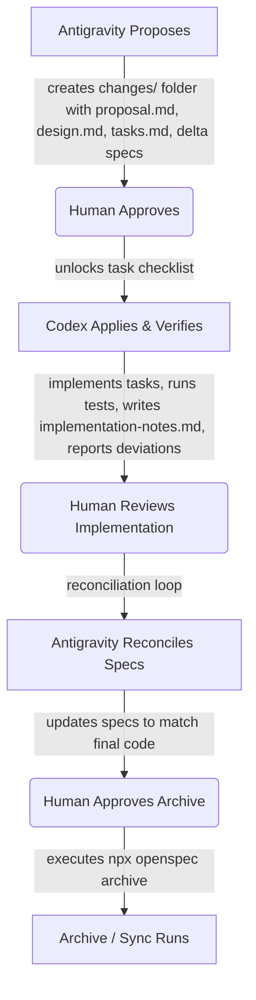

# Decision Article: Specification & Agent Workflow Strategy

**Status:** Draft / Evaluating  
**Author:** Antigravity (Architectural Agent)  
**Date:** 2026-07-10

---

## 1. Executive Summary

This decision article evaluates repository workflow strategies, specification lifecycle options, and agent orchestration patterns for the `ez-chars` repository. Specifically, we investigate **OpenSpec** (by Fission-AI) as a lightweight in-repository framework for product, architecture, and agent-assisted implementation work. We analyze how its repo model, CLI workflows, and spec lifecycle fit with our current local-first MVP backlog, agent-boundary model (`AGENTS.md`), and validation gates.

We compare OpenSpec against five design alternatives (Lightweight ADRs, Strict RFC/PRDs, executable BDD, GitHub Spec Kit, and Example Mapping hybrids) and recommend a hybrid workflow that balances structural rigor with developer agility.

---

## 2. What is OpenSpec?

OpenSpec is an open-source framework designed to implement **Spec-Driven Development (SDD)** in AI-assisted coding. It establishes a structured boundary between planning and code generation.

### 2.1 Repository Model & Folder Structure

OpenSpec introduces a dedicated workspace directory, typically structured as:

```text
openspec/
├── specs/                   # The active system specifications (Source of Truth)
│   └── <feature_path>/
│       └── spec.md          # Living documentation of current behavior
└── changes/                 # Workspaces for active change proposals
    └── <change_id>/
        ├── proposal.md      # The "Why" and "What" of the change
        ├── design.md        # The "How" (technical approach, file modifications)
        ├── tasks.md         # Checklist of implementation tasks
        ├── specs/           # "Delta specs" defining spec changes for this proposal
        └── implementation-notes.md # (Optional) Codex notes on assumptions/anomalies
```

### 2.2 Core Workflow & Lifecycle

OpenSpec operates in a cyclical lifecycle:

1. **Explore:** Analyze the codebase and requirements to understand the problem.
2. **Propose:** The agent creates a change folder under `changes/<change_id>/` with `proposal.md`, `design.md`, `tasks.md`, and delta specs.
3. **Approve:** The human reviews, modifies, and approves these planning artifacts.
4. **Apply:** The agent implements the code step-by-step using the approved `tasks.md` checklist.
5. **Sync/Archive:** Delta specs are merged into `specs/` (updating the source of truth), and the completed change folder is cleaned up or moved to the archive.

### 2.3 CLI & Slash Command Model

- **Terminal CLI (`openspec`)**: Global or local npm command-line tool (`@fission-ai/openspec`). Used for project initialization (`openspec init`), listing change tasks, validation of specifications (conformance check), and archiving completed changes.
- **Chat Slash Commands (`/opsx`)**: Built-in commands supported by AI coding environments (e.g., Cursor, Claude Code, Windsurf) or simulated via agent system prompts:
  - `/opsx:explore`: Investigate context.
  - `/opsx:propose`: Generate proposal, design, and tasks.
  - `/opsx:apply`: Run the implementation based on approved tasks.
  - `/opsx:sync` / `/opsx:archive`: Merge specs and archive changes.

---

## 3. Mapping OpenSpec to Current `ez-chars` Mechanisms

We evaluate how OpenSpec aligns with, complements, or duplicates existing patterns in `ez-chars`:

| `ez-chars` Mechanism                            | OpenSpec Mapping & Fit                                                                                                                                                                                                                                                    |
| :---------------------------------------------- | :------------------------------------------------------------------------------------------------------------------------------------------------------------------------------------------------------------------------------------------------------------------------ |
| **Durable Docs** (`docs/field-*.md`, etc.)      | **High overlap.** OpenSpec's `specs/` folder would absorb our current behavioral specifications, shifting them to a unified directory structure with strict formatting guidelines. Architectural decisions and design rationales continue to reside in lightweight ADRs.  |
| **Backlog Slices** (`docs/mvp-backlog.md`)      | **Workflow shift.** When a non-trivial backlog item enters active refinement, it becomes an OpenSpec change workspace (`changes/<change_id>/`). Small, local, and reversible items may remain direct backlog tasks.                                                       |
| **Agent Boundary** (`AGENTS.md`)                | **Excellent alignment.** `AGENTS.md` divides work between **Antigravity** (Architecture/Specs) and **Codex** (Code/Tests). OpenSpec's split between Propose (Architectural Ideation/Design) and Apply (Implementation/Execution) directly mirrors this division of labor. |
| **Skillsets** (Codex Skills)                    | **Complementary.** OpenSpec tasks can be combined with specific Codex skills (e.g. Svelte 5 UI work, storage migration) to standardise code implementation.                                                                                                               |
| **Verification Gates** (`docs/verification.md`) | **Orthogonal.** OpenSpec CLI validates the markdown syntax and structure of specs/scenarios, but does not run Svelte diagnostics or Vitest. Local verification gates must still run in `tasks.md` or a `/opsx:verify` check.                                              |
| **Svelte Tooling & Local-First Style**          | **Neutral.** OpenSpec is technology-stack agnostic. It handles specification and tasks but doesn't affect local-first implementation mechanics directly.                                                                                                                  |

---

## 4. Evaluation of OpenSpec

### 4.1 Pros

1. **Durable Knowledge Preservation:** Moving current behavioral requirements out of chat history and into `openspec/specs/` gives agents a durable, discoverable description of expected system behavior. Significant architectural rationale and rejected alternatives should remain in dedicated decision records or design documents.
2. **Explicit Planning Checkpoint:** Enforces that a human approves the technical design (`design.md`) and task checklist (`tasks.md`) before any code is generated.
3. **Delta-Spec Driven:** Focusing on spec differences makes it highly compatible with existing codebase structures ("brownfield" projects).
4. **Natural Agent Division:** Cleanly separates Antigravity's role (building the proposal, design, and specs) from Codex's role (executing `tasks.md`).

### 4.2 Cons & Gaps (With Mitigations)

1. **Tooling Dependency:** Requires installing the `@fission-ai/openspec` npm package.
   - _Status:_ User approved adding this as a dev dependency. We can install `@fission-ai/openspec` locally and execute it via `npx` or local npm scripts.
2. **Slash Command Friction:** Slash commands like `/opsx:propose` depend on IDE-level support (e.g. Cursor or Claude Code).
   - _Mitigation:_ The agent can execute the equivalent terminal CLI commands directly (e.g., running `npx @fission-ai/openspec <cmd>` via the `run_command` tool) or map these actions to explicit instructions in [../AGENTS.md](../AGENTS.md) and project-local Codex skills. This bridges the gap for clients that don't natively support `/opsx:` chat shortcuts.
3. **Formatting Overhead & Process Weight:** OpenSpec expects specs to be structured in precise requirements/scenarios for validation, and creating a dedicated change folder for every small slice can feel heavy for a small MVP.
   - _Mitigation (Vibecoding / Fast-Track Mode):_ We can introduce a "Fast-Track" or "Vibecode" rule in [../AGENTS.md](../AGENTS.md). For small, low-risk, styling, or documentation-only slices, the agent can directly implement the changes without a formal proposal folder. A fast-track change that does not alter durable behavior requires no spec update. A change that alters meaningful durable behavior must either update an existing spec directly or be run as a small formal change. OpenSpec also supports archiving while skipping spec updates for infrastructure, tooling, or documentation-only changes.

---

## 5. Design Alternatives Exploration

### 5.1 Lightweight Markdown ADRs + Backlog Slices (Current Improved)

This alternative refines our existing raw markdown backlog (`docs/mvp-backlog.md`) and guidelines (`AGENTS.md`), adding a formal but lightweight Architecture Decision Record (ADR) system in `docs/decisions/` (or `docs/specs/`) for complex architectural changes.

#### 5.1.1 Mapping to `ez-chars` Mechanisms

| `ez-chars` Mechanism                   | ADRs + Backlog Slices Fit & Workflow                                                                                                                                                                                                            |
| :------------------------------------- | :---------------------------------------------------------------------------------------------------------------------------------------------------------------------------------------------------------------------------------------------- |
| **Durable Docs**                       | **Natural integration.** Architectural decisions are captured as markdown files under `docs/decisions/YYYY-MM-DD-title.md` or `docs/specs/feature-spec.md`. They remain permanent, searchable, versioned documents in the codebase.             |
| **Backlog Slices**                     | **Direct fit.** We continue to use a single queue (`docs/mvp-backlog.md`) with distinct, atomic suggested slices. Active task tracking remains in the backlog, checking off slices as they are completed.                                       |
| **Agent Boundary**                     | **Clean boundary.** **Antigravity** drafts the ADR/Spec and refines the backlog slice. **Codex** references the ADR/Spec to implement the code and test coverage. The definition-of-done in the backlog slice serves as Codex's task checklist. |
| **Skillsets**                          | **Fully compatible.** Project-local Codex skills can be defined to execute common tasks (e.g. running Svelte typechecks, Vitest tests, or storage validations).                                                                                 |
| **Verification Gates**                 | **Fully integrated.** The backlog slice's definition of done explicitly lists verification steps. The agent runs `npm run test` / `check` / `lint` / `build` as standard.                                                                       |
| **Svelte Tooling & Local-First Style** | **Zero-dependency.** Fits the lightweight, local-first ethos of the project. No CLI tools or IDE integrations required.                                                                                                                         |

---

### 5.2 Strict RFC/PRD Workflow

This alternative adapts a formal, document-first planning approach. Product features start as Product Requirements Documents (PRDs) under `docs/prds/` defining the "Why" and "What." Technical designs are proposed as Request for Comments (RFCs) under `docs/rfcs/` defining the "How."

#### 5.2.1 Mapping to `ez-chars` Mechanisms

| `ez-chars` Mechanism                   | Strict RFC/PRD Fit & Workflow                                                                                                                                                                                                  |
| :------------------------------------- | :----------------------------------------------------------------------------------------------------------------------------------------------------------------------------------------------------------------------------- |
| **Durable Docs**                       | **Extremely high durability.** Features are fully specified in standalone PRD and RFC markdown documents (e.g. `docs/rfcs/001-field-binding.md`). These form a permanent and chronological archive of the project's evolution. |
| **Backlog Slices**                     | **Referential fit.** Backlog items are created _after_ an RFC is approved. The backlog slice references the RFC for all implementation details and maps its "Implementation Plan" to backlog tasks.                            |
| **Agent Boundary**                     | **Explicit handoff.** **Antigravity** writes the PRD and RFC. Once the human approves the RFC, **Codex** is handed the backlog slice to implement it.                                                                          |
| **Skillsets**                          | **Fully compatible.** Project-local Codex skills can be used during implementation.                                                                                                                                            |
| **Verification Gates**                 | **Structured.** The RFC's "Verification and Testing Plan" details specific checks. The agent runs standard tests/checks/lints to satisfy these.                                                                                |
| **Svelte Tooling & Local-First Style** | **Zero-dependency.** Pure markdown and git. No special CLI or IDE integrations.                                                                                                                                                |

### 5.3 Spec-Driven Tests / BDD (Behavior Driven Development)

This alternative uses executable test suites (Gherkin/Cucumber feature files, or Vitest/Playwright tests with BDD-style `describe`/`it`/`given`/`when`/`then` syntax) as the primary specification. The code and tests themselves serve as the living documentation.

#### 5.3.1 Mapping to `ez-chars` Mechanisms

| `ez-chars` Mechanism                   | Spec-Driven Tests / BDD Fit & Workflow                                                                                                                                                                                                               |
| :------------------------------------- | :--------------------------------------------------------------------------------------------------------------------------------------------------------------------------------------------------------------------------------------------------- |
| **Durable Docs**                       | **Code-level durability.** The specification lives in test files (e.g. `src/schema/__tests__/character.spec.ts`). It cannot drift from actual behavior without failing, but it is less readable for non-technical stakeholders compared to markdown. |
| **Backlog Slices**                     | **Direct test alignment.** Backlog slices are implemented by first writing failing spec tests, then writing code to pass them.                                                                                                                       |
| **Agent Boundary**                     | **Test-first boundary.** **Antigravity** drafts the test suite structure and mock data models. **Codex** writes the actual code and test implementation, verifying success when tests turn green.                                                    |
| **Skillsets**                          | **Excellent fit.** Pairs naturally with Codex skills for test execution, mock setups, and Svelte component rendering assertions.                                                                                                                     |
| **Verification Gates**                 | **Deeply unified.** Running `npm run test` executes both the test suite and the behavioral specification.                                                                                                                                            |
| **Svelte Tooling & Local-First Style** | **Dependency-heavy.** Often requires additional test runners, mounting libraries, or Gherkin parsers (e.g. Cucumber plugins) to write readable features.                                                                                             |

### 5.4 GitHub Spec Kit

GitHub Spec Kit (`spec-kit`) is an open-source toolkit and framework designed for Spec-Driven Development (SDD) with AI agents. It uses a python-based CLI tool (`specify`) to enforce structured phase gates: Constitution -> Specify -> Plan -> Tasks -> Implement.

#### 5.4.1 Mapping to `ez-chars` Mechanisms

| `ez-chars` Mechanism                   | GitHub Spec Kit Fit & Workflow                                                                                                                                                          |
| :------------------------------------- | :-------------------------------------------------------------------------------------------------------------------------------------------------------------------------------------- |
| **Durable Docs**                       | **Extremely high.** Stores memory and specs under a `.specify/` folder. It uses `constitution.md` to enforce immutable codebase principles and rules that the agent must always follow. |
| **Backlog Slices**                     | **Direct task integration.** It generates task lists (`/speckit.tasks`) which can map onto backlog items or execution scripts.                                                          |
| **Agent Boundary**                     | **Highly rigid phases.** The CLI guides the agent through structured gates. Antigravity handles Constitution, Specification, and Planning. Codex handles Tasks and Implementation.      |
| **Skillsets**                          | **Native integration.** Automatically sets up agent-specific directories and custom tools/skills (e.g. `.claude/skills/`) to integrate with the agent's context.                        |
| **Verification Gates**                 | **Compatible.** Integrates standard verification steps into the task checklist.                                                                                                         |
| **Svelte Tooling & Local-First Style** | **Heavyweight.** Requires Python and the `uv`/`uvx` package manager to run the CLI. Adds complex `.specify/` structures and agent configurations to the workspace.                      |

### 5.5 Example Mapping + Selective Gherkin (Hybrid BDD)

This hybrid alternative combines **Example Mapping** (a structured conversation framework to discover Rules, Examples, Questions, and Stories) with **selective Gherkin syntax specs** (Given-When-Then format written in markdown files). Crucially, Gherkin syntax is only executed as automated tests for complex core logic (e.g. state patches, HP math, schema parsing); standard UI and styling behaviors remain documented as simple text scenarios without test-automation overhead.

#### 5.5.1 Mapping to `ez-chars` Mechanisms

This hybrid alternative combines **Example Mapping** (a structured conversation framework to discover Rules, Examples, Questions, and Stories) with **selective Gherkin syntax specs** (Given-When-Then format written in markdown files).

### 5.6 Side-by-Side Comparison Matrix

| Feature / Dimension           | OpenSpec (with Mitigations)                                        | ADRs + Backlog Slices (Current Improved)                     | Strict RFC/PRD Workflow                                                          | Spec-Driven Tests / BDD                                                                                                                  | GitHub Spec Kit                                                           | Example Mapping + Selective Gherkin                                                   | Hybrid (Mitigated OpenSpec + Example Mapping)                                                                      |
| :---------------------------- | :----------------------------------------------------------------- | :----------------------------------------------------------- | :------------------------------------------------------------------------------- | :--------------------------------------------------------------------------------------------------------------------------------------- | :------------------------------------------------------------------------ | :------------------------------------------------------------------------------------ | :----------------------------------------------------------------------------------------------------------------- |
| **Tooling Dependency**        | Requires `@fission-ai/openspec` (dev dependency).                  | None (pure markdown and git).                                | None (pure markdown and git).                                                    | May require additional BDD parsers/test libraries.                                                                                       | Requires Python, `uv`/`uvx`, and `specify-cli`.                           | None (Gherkin specs in markdown, Vitest for selective tests).                         | Requires `@fission-ai/openspec` (dev dependency).                                                                  |
| **Workspace Overhead**        | Introduces `openspec/` with active and archived changes.           | None. Keeps docs in `docs/` or backlog.                      | High. Adds structured `docs/prds/` and `docs/rfcs/`.                             | Low. Keeps specs inside `__tests__/` folders.                                                                                            | High. Adds `.specify/` configuration and agent skill files.               | Low. Keeps spec maps in `docs/specs/` or `__tests__/`.                                | Moderate. Active changes under `openspec/changes/` are archived; specs grow prospectively under `openspec/specs/`. |
| **Spec-to-Code Traceability** | Strong. Merges delta specs into main specs via CLI `archive` step. | Moderate. Relies on manual document updates and Git history. | Very Strong. Numbered RFCs map directly to commit boundaries.                    | Strong for behavior represented by executable scenarios; incomplete for untested requirements, rationale, and architectural constraints. | Very Strong. Enforces strict mapping of specs to tasks.                   | Strong. Rules and Gherkin examples map directly to unit tests and slices.             | Strong. Delta specs merge into `specs/` via archive; rules and examples map to commit boundaries.                  |
| **Process Friction**          | Higher. Enforces proposal/design/task folder creation.             | Lower. Highly flexible, easy to write and update.            | High. Requires writing separate PRD/RFC documents.                               | High. Writing BDD specs for UI can be verbose.                                                                                           | Very High. Strict multi-stage phase gates.                                | Moderate. Requires structuring requirements into rules and examples.                  | Moderate. Restricts formal workspaces only to non-trivial changes, utilizing organic Example Maps.                 |
| **Vibecoding / Fast-Track**   | Requires explicit rules to bypass proposal folders.                | Agent can immediately vibecode and update docs.              | Weak fit for frequent fast-track work. Requires formal RFC cycles before coding. | Mixed. Can prototype code, but requires retrofitting test suites.                                                                        | Weak fit for frequent fast-track work. Enforces rigid step-by-step gates. | Native. Fast-track edits are permitted, adding rules/examples only for complex logic. | Strong. Explicit Change-Classification thresholds permit fast-track bypass for low-risk changes.                   |
| **Agent Coordination**        | Automated task runner interface via `tasks.md` and `/opsx:apply`.  | Manual checklist alignment via backlog slice.                | Explicit handoff: spec (RFC) is finalized before code starts.                    | Green-light feedback: Codex writes implementation until tests pass.                                                                      | Highly automated. Integrates custom skills/commands directly.             | Highly structured. Spec maps provide clear, testable boundaries for Codex.            | Excellent. Clear handoff gates (Antigravity planning vs Codex applying) and human validation checkpoints.          |

---

## 6. Recommendation: Mitigated OpenSpec + Example Mapping (Hybrid)

To address the "loosey-goosey" feel of a single raw backlog file while keeping the process organic and free of excessive overhead, we recommend adopting a **Mitigated OpenSpec + Example Mapping (Hybrid)** workflow.

One of the principal motivations for this workflow is improving **context locality**. Active implementation artifacts (proposals, designs, task checklists, specs, and notes) should exist close together so implementation agents spend less effort reconstructing intent from distributed documentation.

### 6.1 Why OpenSpec?

OpenSpec is being adopted not because its directory structure is unique, but because it provides an existing, maintained implementation of the desired workflow including lifecycle commands, validation, and synchronization. Should these capabilities fail to provide meaningful value during the pilot, the workflow itself remains portable to a pure Markdown implementation. The workflow owns the tool, not the reverse.

### 6.2 Core Concepts of the Recommended Workflow

1. **High-Level Roadmap:** Keep [docs/mvp-backlog.md](docs/mvp-backlog.md) as the simple, prioritized backlog queue for humans and agents to scan.
2. **Isolated Task Execution (Context Locality):** When starting a non-trivial backlog item (e.g. `p1-002`, `p1-022`), the agent creates an OpenSpec change folder: `openspec/changes/<change_id>/`. This isolates active execution tasks (`tasks.md`) from the main backlog, preventing clutter and intermediate checkbox noise.
3. **Structured & Organic Specifications:** Within the change folder, the agent defines the feature's behavior in `proposal.md` and `design.md` using **Example Mapping** (organizing rules, examples, and open questions) and **selective Gherkin scenarios** (Given-When-Then format) for complex behavior.
4. **Intermediate Implementation Notes:** During development, Codex can optionally write to `changes/<change_id>/implementation-notes.md` to capture discovered anomalies, library quirks, or minor design updates. These notes provide valuable context during code review and disappear after archive.
5. **Durable Knowledge Base:** The approved behavioral rules and scenarios must be represented in the change's delta specs. Archiving then merges those delta specs into the durable specification catalog under `openspec/specs/` and moves the completed change into the archive.
6. **Vibecoding Fast-Track:** For minor styling tweaks, typo corrections, or simple text modifications, agents are explicitly allowed to bypass the OpenSpec folders and edit code directly. A fast-track change that does not alter durable behavior requires no spec update. A change that alters meaningful durable behavior must either update an existing spec directly or be run as a small formal change. OpenSpec also supports archiving while skipping spec updates for infrastructure, tooling, or documentation-only changes.

---

### 6.3 Change-Classification Thresholds & ADR Triggers

To prevent subjective workflow decisions, we establish a classification threshold for incoming work:

| Change Type                                                                                                | Workflow                                                            |
| :--------------------------------------------------------------------------------------------------------- | :------------------------------------------------------------------ |
| Typo, styling adjustment, isolated refactor with no behavioral change                                      | **Fast-track** (bypass changes folder; direct edit; no spec update) |
| Small behavior change with obvious scope and one or two files                                              | **Refined backlog slice** or compact OpenSpec change                |
| New user behavior, schema change, persistence change, cross-component work, or unresolved design questions | **Full OpenSpec change** (Propose -> Approve -> Apply -> Archive)   |
| Durable architectural choice or meaningful tradeoff                                                        | **OpenSpec change plus ADR** (Architecture Decision Record)         |

#### 6.3.1 ADR Triggers

While OpenSpec specs define _what_ the system does, ADRs (Architecture Decision Records) record _why_ it was shaped that way. If an implementation results in any of the following, the agent must create a lightweight ADR under `docs/decisions/`:

- A permanent architecture change (e.g., changing Svelte store architecture).
- A design trade-off selection (e.g., choosing `immutable-json-patch` over custom diffing).
- A public API boundary decision.
- A storage/schema evolution or migration strategy.
- A new package or dependency adoption.

---

### 6.4 Agent Integration & Handoff Workflow

To ensure clear architectural boundaries and acceptance gates, the collaborative workflow is structured as follows:



1. **Antigravity Proposes:** Runs the Explore/Propose cycle, creates Example Maps (identifying Rules, Examples, and Questions), drafts the technical design, and designs the `tasks.md` checklist.
2. **Human Approves:** Reviews and approves the proposal and task checklist.
3. **Codex Applies & Verifies:** Implements the tasks, runs local verification gates, writes selective tests, logs discoveries in `implementation-notes.md`, and reports any deviations.
4. **Human Reviews:** Reviews the code, tests, and implementation notes.
5. **Antigravity Reconciles:** Reconciles the approved design, implementation outcomes, and durable specifications, incorporating approved implementation discoveries where appropriate.
6. **Human Approves Archive:** Reviews and validates the final spec.
7. **Archive Runs:** Executes the archive command to merge delta specs into `openspec/specs/` and move the change workspace (including the ephemeral implementation notes) to the archive.

---

### 6.5 Workflow Principles

This workflow intentionally favors the following principles over strict adherence to any particular tool or framework:

- **Context locality over centralized planning.** Active implementation artifacts should remain colocated so agents spend less effort reconstructing intent.
- **Durable knowledge over chat history.** Architectural decisions, specifications, and rationale belong in version-controlled artifacts.
- **Human approval before durable architectural change.** Agents may propose and implement changes, but humans approve architectural direction and canonical specifications.
- **Small, independently verifiable implementation slices.** Features should be refined into bounded tasks that can be implemented, reviewed, and validated independently.
- **Portable workflows over tool lock-in.** The repository workflow should remain executable using ordinary Markdown and Git, regardless of whether OpenSpec or another orchestration framework is used.
- **Automation where it reduces cognitive load.** Tooling should remove repetitive work, not introduce additional ceremony.
- **Fast paths for low-risk work.** Trivial, local, and reversible changes should remain inexpensive while preserving rigor for behaviorally significant work.
- **Continuous refinement through real usage.** Workflow improvements should be driven by lessons learned during implementation rather than theoretical completeness.

These principles intentionally outlive any specific tooling choice and should guide future evolution of the repository workflow.

---

### 6.6 Pilot Validation Framework

Rather than performing a repository-wide overhaul upfront, this workflow is adopted as a **limited pilot** using backlog item `p1-002` to validate:

- **Antigravity Effectiveness:** Whether Antigravity produces materially better, less hand-held task descriptions.
- **Codex Autonomy:** Whether Codex navigates the localized change workspace more reliably than the monolithic backlog file.
- **Document Drift:** Whether sync/archive actually reduces stale documentation instead of creating duplicate specs.
- **Overhead Weight:** Whether the formal path remains light enough that we do not reflexively bypass it.

_Note: Existing durable documents (such as architecture design files) will not be migrated upfront; the durable specs folder will grow prospectively. Existing docs remain where they are until a change naturally touches them._

---

## 7. Evaluation and Rejections

- **Rejected: Strict RFC/PRD Workflow.** This presents disproportionate overhead for this project. For a single-developer, local-first web app, writing full PRDs and RFCs for every detail slows down iteration.
- **Rejected: Full Spec-Driven Tests / Executable BDD.** This would introduce substantial boilerplate when applied broadly. Writing automated integration tests for every UI component or Svelte visual element results in high maintenance cost.
- **Rejected: Raw Markdown Backlog Slices (Current unimproved).** Leaving the backlog as a single, monolithic file carrying multiple responsibilities makes active tasks hard to isolate and leads to spec drift.
- **Rejected: GitHub Spec Kit.** This CLI tool has a weak fit for frequent fast-track work and introduces Python environment dependency (`uv`/`uvx`) with rigid phase gates that add friction.

---

## 8. Consequences and Follow-Ups for `p1-002`

Adopting this workflow means that in the follow-on task **`p1-002`**, we will perform the following restructuring:

1. **Dev-Dependency Installation:** Add `@fission-ai/openspec` to `devDependencies` in `package.json`.
2. **Backlog Refining:** Reorganize [docs/mvp-backlog.md](docs/mvp-backlog.md) to reference specs and OpenSpec change IDs.
3. **Agent Integration (`AGENTS.md`):** Update the agent guide to define the structured proposal/implementation boundaries:
   - **Antigravity:** Explore/Propose phase, Example Maps, task checklist design, spec reconciliation.
   - **Codex:** Apply phase (implementing tasks, running verification, writing selective tests, reporting deviations).
   - **Human acceptance:** Approving workspace designs, reviews of implementation, and approving archive execution.
4. **Fast-Track Rules:** Explicitly document the change-classification thresholds and rules of the "Vibecoding Fast-Track" in the guidelines.

---

_Please review the finalized recommendation. We are ready to proceed with refining backlog item `p1-002` to implement this chosen specs/backlog workflow once this decision is approved._

---

## 9. Future Documentation Evolution

This decision establishes the architectural direction of the repository workflow but intentionally does not prescribe its detailed operating procedures.

As the pilot progresses, additional documentation may be introduced to capture stable operational practices, such as feature-development workflows, agent operating procedures, prompt libraries, or onboarding guidance.

These documents should implement the principles established by this decision rather than redefine them.
